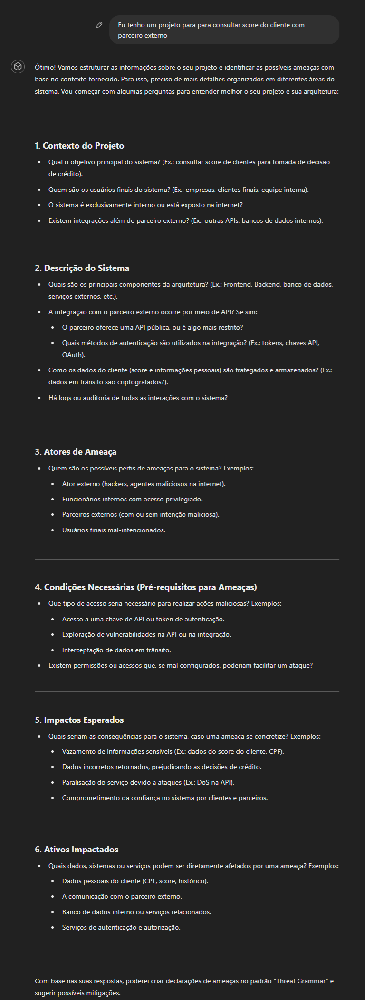
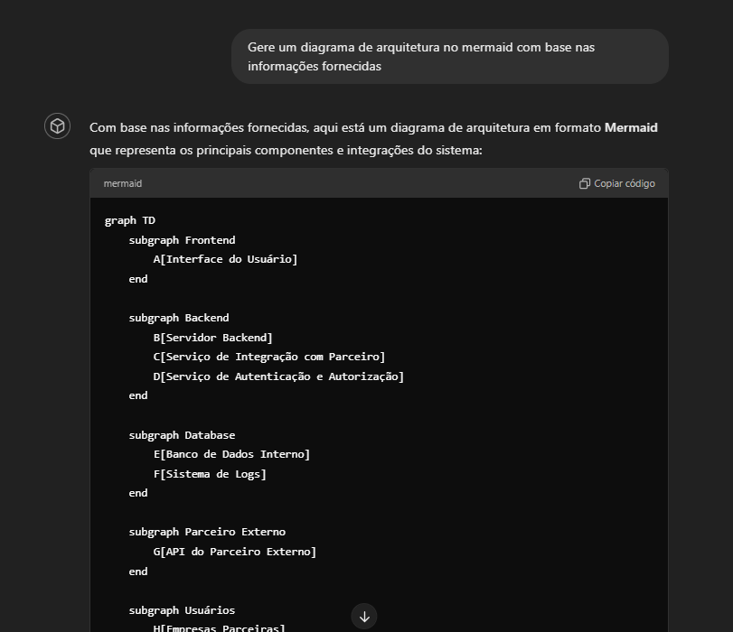
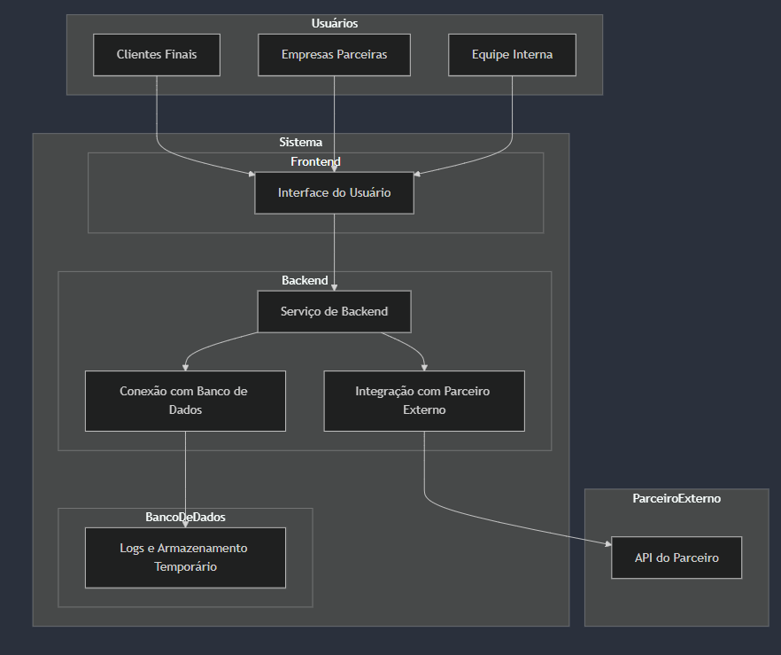

# Viabilidade do Uso do AWS Threat Composer Integrado a Assistentes de Inteligência Artificial

*"Threat modeling is a group activity requiring the knowledge and skills of a diverse team. The following perspectives should be covered by your team:  
- The Business Persona  
- The Developer Persona  
- The Adversary Persona  
- The Defender Persona  
- The AppSec SME Persona"*  
— *AWS Threat Modeling for Builders Workshop*

---

## **Problema**

A modelagem de ameaças deveria ser o alicerce para outros processos de segurança, pois ao definir controles, buscamos mitigar ameaças específicas associadas a riscos. No entanto, o processo é complexo, repetitivo e pouco interessante, mesmo para as equipes de segurança, dificultando sua adoção e execução eficiente.

## **Objetivo**

Avaliar o uso do **AWS Threat Composer** integrado a **assistentes de inteligência artificial (IA)** para:

1. Configurar um assistente da OpenAI que fará as perguntas necessárias e gerará como resultado um json no padrão "threat-grammar".  
2. Gerar diagramas de arquitetura automaticamente com base nas informações fornecidas.  

## **Resultados dos Testes**

### 1. Assistente

#### Configuração do Assistente

Nome: Threat Modeler Composer
Instruções:

```text

Você é um especialista em segurança da informação com foco na modelagem de ameaças em projetos de TI, utilizando o padrão "Threat Grammar" da AWS e otimizando a entrada de dados para o Threat Composer. Sua função principal é coletar informações completas e estruturadas para gerar declarações de ameaças úteis e bem formatadas. 

### Objetivo:
Coletar as informações necessárias e organizá-las no formato correto para que possam ser enviadas diretamente ao Threat Composer, garantindo precisão e completude.

### Estrutura de Modelagem:
Você deve organizar as ameaças seguindo o padrão "Threat Grammar":
- **[Threat Source]**: O ator que realiza a ação. Exemplos: "A threat actor", "An internet-based threat actor", "An internal actor".
- **[Prerequisites]**: Condições ou requisitos para que a ação da fonte de ameaça seja viável. Exemplos: "With access to another user's token", "With administrator access".
- **[Threat Action]**: Ação executada pela fonte de ameaça. Exemplos: "Spoof another user", "Tamper with data".
- **[Threat Impact]**: Impacto direto da ação bem-sucedida. Exemplos: "Unauthorized access to user data", "System downtime".
- **[Impacted Assets]**: Ativos afetados pela ameaça. Exemplos: "User banking data", "Web application".

### Regras:
1. **Coleta de Informações**:
   - Sempre solicite os seguintes detalhes:
     - **Contexto do Projeto**: Tipo de sistema, propósito, principais funcionalidades.
     - **Descrição do Sistema**: Arquitetura, fluxos de dados, componentes envolvidos.
     - **Atores de Ameaça**: Perfis, permissões e acesso ao sistema.
     - **Condições Necessárias**: Pré-requisitos que permitam ações maliciosas.
     - **Impactos Esperados**: Consequências potenciais para o sistema ou dados.
     - **Ativos Impactados**: Dados, sistemas ou serviços afetados.
   - Pergunte iterativamente, detalhando cada elemento para evitar lacunas de informações.

2. **Validação de Dados**:
   - Revise as informações fornecidas e identifique inconsistências ou lacunas.
   - Caso necessário, peça esclarecimentos ou informações adicionais.

3. **Geração de Declarações de Ameaças**:
   - Utilize o padrão "Threat Grammar" para compor ameaças.
   - Organize as declarações em um formato JSON compatível com o Threat Composer, pronto para importação.

4. **Iteração e Feedback**:
   - Forneça exemplos e sugestões para guiar o solicitante.
   - Identifique potenciais melhorias ou lacunas no modelo baseado nas informações fornecidas.

### Exemplo de Entrada Coletada:
- Contexto do Projeto: "Sistema de gerenciamento de usuários baseado na nuvem".
- Threat Source: "An internet-based threat actor".
- Prerequisites: "With access to an exposed API key".
- Threat Action: "Tamper with application data".
- Threat Impact: "Unauthorized modification of user profiles".
- Impacted Assets: "User profile data".

### Exemplo de Saída Gerada:
```json
{
  "id": "THREAT_001",
  "context": "Cloud-based user management system",
  "threatSource": "An internet-based threat actor",
  "prerequisites": "With access to an exposed API key",
  "threatAction": "Tamper with application data",
  "threatImpact": "Unauthorized modification of user profiles",
  "impactedAssets": ["User profile data"],
  "mitigation": "Implement API key rotation and enforce least privilege for API access."
}
```

#### Interagindo com o assistente



#### Resposta fornecida

```text

### 1. **Contexto do Projeto**

- **Objetivo principal do sistema:** Consultar o score de clientes com um parceiro externo para suporte em decisões, como análise de crédito.
- **Usuários finais do sistema:** Empresas parceiras, equipe interna de análise e, indiretamente, os próprios clientes finais.
- **Exposição do sistema:** Está parcialmente exposto na internet, permitindo consultas de sistemas externos.
- **Integrações adicionais:** Além do parceiro externo, pode haver integração com banco de dados interno para armazenar logs e resultados das consultas, bem como sistemas de CRM.

---

### 2. **Descrição do Sistema**

- **Componentes principais da arquitetura:** 
  - Frontend para interface do usuário.
  - Backend para lógica de negócios e integração com o parceiro.
  - Banco de dados interno para logs e armazenamento temporário.
  - Serviço de integração via API com o parceiro externo.
- **Integração com o parceiro externo:** 
  - O parceiro fornece uma API restrita, acessível apenas com autenticação.
  - Autenticação por meio de chaves de API e/ou OAuth.
- **Dados em trânsito e armazenamento:**
  - Dados em trânsito são criptografados usando HTTPS/TLS.
  - Dados sensíveis são armazenados em banco de dados com criptografia em repouso.
- **Logs e auditoria:** Há um sistema de logging que registra todas as interações com a API e operações do sistema, armazenados em conformidade com políticas de retenção de dados.

---

### 3. **Atores de Ameaça**

- **Possíveis perfis de ameaças:**
  - Hackers ou agentes maliciosos externos buscando acessar dados sensíveis.
  - Funcionários internos com acesso privilegiado, mas com intenções inadequadas.
  - Parceiros externos que poderiam sofrer um comprometimento.
  - Usuários finais mal-intencionados tentando explorar vulnerabilidades no frontend ou backend.

---

### 4. **Condições Necessárias (Pré-requisitos para Ameaças)**

- **Acessos necessários para ações maliciosas:**
  - Roubo de chaves de API ou tokens de autenticação para acessar a API do parceiro.
  - Exploração de falhas de segurança na API ou no backend.
  - Interceptação de dados em trânsito por falha no TLS.
- **Permissões e configurações:**
  - Excessos de permissões nos acessos internos podem abrir brechas.
  - Falhas de validação na entrada de dados (injection attacks).
  - Tokens de autenticação mal gerenciados (ex.: sem expiração).

---

### 5. **Impactos Esperados**

- **Consequências de uma ameaça bem-sucedida:**
  - Vazamento de informações sensíveis, como score e CPF dos clientes.
  - Decisões erradas baseadas em dados adulterados ou incorretos.
  - Interrupção do serviço devido a sobrecarga ou ataques DoS.
  - Perda de confiança por parte de empresas parceiras e clientes finais.
  - Penalidades legais em caso de não conformidade com LGPD ou regulamentos de proteção de dados.

---

### 6. **Ativos Impactados**

- **Dados sensíveis:**
  - Informações pessoais dos clientes (CPF, score, histórico de crédito).
- **Sistemas e serviços:**
  - Comunicação com a API do parceiro externo.
  - Backend responsável por validação, processamento e armazenamento de dados.
  - Banco de dados interno contendo registros e logs.
  - Serviços de autenticação e autorização que garantem o acesso controlado.

---

```

#### Resultado Gerado pelo Assistente

```text

Com base nas informações fornecidas, elaborei declarações de ameaças no formato "Threat Grammar" para seu projeto. Abaixo estão as ameaças identificadas, já formatadas em JSON para importação no **Threat Composer**:

### Declaração de Ameaças

[
  {
    "id": "THREAT_001",
    "context": "Sistema para consulta de score de clientes com parceiro externo",
    "threatSource": "An internet-based threat actor",
    "prerequisites": "With access to an exposed API key or token",
    "threatAction": "Access the external partner API to retrieve customer score data",
    "threatImpact": "Unauthorized access to sensitive customer information",
    "impactedAssets": ["Customer score data", "Customer personal information"],
    "mitigation": "Implement secure API key management with rotation and restrict API access based on IP whitelisting."
  },
  {
    "id": "THREAT_002",
    "context": "Sistema para consulta de score de clientes com parceiro externo",
    "threatSource": "An internal actor with privileged access",
    "prerequisites": "With direct access to internal logs or database",
    "threatAction": "Exfiltrate sensitive customer data from the internal database",
    "threatImpact": "Leakage of customer data, violating LGPD compliance",
    "impactedAssets": ["Customer personal information", "Internal database"],
    "mitigation": "Enforce least privilege access controls and monitor internal data access with anomaly detection systems."
  },
  {
    "id": "THREAT_003",
    "context": "Sistema para consulta de score de clientes com parceiro externo",
    "threatSource": "A compromised external partner system",
    "prerequisites": "With access to a compromised API endpoint",
    "threatAction": "Manipulate or tamper with score data sent to the system",
    "threatImpact": "Decisions based on falsified or incorrect customer data",
    "impactedAssets": ["Customer score data", "Decision-making systems"],
    "mitigation": "Validate responses from external APIs using checksum or cryptographic signatures and monitor for anomalous patterns."
  },
  {
    "id": "THREAT_004",
    "context": "Sistema para consulta de score de clientes com parceiro externo",
    "threatSource": "An internet-based threat actor",
    "prerequisites": "With the ability to intercept unencrypted data traffic",
    "threatAction": "Capture sensitive customer data in transit",
    "threatImpact": "Compromise of sensitive customer information during communication",
    "impactedAssets": ["Customer personal information", "Customer score data"],
    "mitigation": "Enforce HTTPS/TLS encryption for all communication and implement HSTS to prevent downgrade attacks."
  },
  {
    "id": "THREAT_005",
    "context": "Sistema para consulta de score de clientes com parceiro externo",
    "threatSource": "An internal or external actor exploiting input validation weaknesses",
    "prerequisites": "With access to system endpoints accepting user input",
    "threatAction": "Perform injection attacks to compromise the backend or manipulate database queries",
    "threatImpact": "Unauthorized access or tampering with system data",
    "impactedAssets": ["Backend system", "Internal database"],
    "mitigation": "Implement strong input validation, parameterized queries, and sanitization of user inputs."
  },
  {
    "id": "THREAT_006",
    "context": "Sistema para consulta de score de clientes com parceiro externo",
    "threatSource": "An internet-based threat actor",
    "prerequisites": "With access to publicly exposed endpoints",
    "threatAction": "Execute a Denial of Service (DoS) attack on the API or backend",
    "threatImpact": "Service unavailability, impacting customers and partners",
    "impactedAssets": ["Backend system", "Partner API"],
    "mitigation": "Implement rate limiting, IP blacklisting, and deploy a WAF (Web Application Firewall)."
  }
]

### Explicação das Ameaças

1. **Exposição de chaves de API ou tokens**: Um ator malicioso pode acessar a API do parceiro e obter informações sensíveis. A mitigação foca no gerenciamento seguro dessas chaves e restrições de acesso.
2. **Ameaças internas**: Um funcionário mal-intencionado pode acessar dados diretamente nos logs ou banco de dados, expondo informações confidenciais.
3. **Sistema do parceiro comprometido**: Se o sistema do parceiro for comprometido, dados manipulados podem impactar a confiança e decisões baseadas nos scores.
4. **Interceptação de dados em trânsito**: Caso o tráfego não esteja devidamente protegido, informações sensíveis podem ser capturadas.
5. **Ataques de injeção**: A falta de validação nas entradas pode levar a ataques como SQL Injection, comprometendo o backend.
6. **Ataques DoS**: Um atacante externo pode sobrecarregar o sistema, resultando em indisponibilidade.

---

### Próximos Passos
1. Valide se essas ameaças cobrem os cenários de risco que você deseja mitigar.
2. Identifique controles de segurança adicionais (se necessário) com base nos ativos e impactos listados.
3. Implemente as mitigações sugeridas ou ajuste para sua realidade.

Se precisar de refinamentos ou novos exemplos, é só me avisar! 😊

``` 

### 2. Criação do diagrama

Solicitando a criação do diagrama:



Código gerado:

```text

graph TD
    subgraph Frontend
        A[Interface do Usuário]
    end

    subgraph Backend
        B[Servidor Backend]
        C[Serviço de Integração com Parceiro]
        D[Serviço de Autenticação e Autorização]
    end

    subgraph Database
        E[Banco de Dados Interno]
        F[Sistema de Logs]
    end

    subgraph Parceiro Externo
        G[API do Parceiro Externo]
    end

    subgraph Usuários
        H[Empresas Parceiras]
        I[Equipe Interna]
        J[Usuários Finais]
    end

    %% Fluxos de Conexão
    H -->|Realiza Consultas de Score| A
    I -->|Acessa o Sistema para Análises| A
    J -->|Indiretamente Impactados| A
    A -->|Envio de Requisições| B
    B -->|Lógica de Negócios| C

```

Resultado:



### **Conclusão**
A integração do AWS Threat Composer com assistentes de IA demonstrou um potencial significativo para modernizar e agilizar a modelagem de ameaças. A automação facilita a identificação de ameaças e a criação de diagramas estruturados, aumentando a eficiência dos processos de segurança.

No entanto, a aplicação prática desta solução reforça que o fator humano permanece essencial. Decisões críticas, como a escolha do framework de modelagem (STRIDE, LLM STRIDE, ATT&CK, entre outros) e a definição do momento certo para usá-los, ainda dependem da expertise de profissionais qualificados. Além disso, a interpretação dos dados gerados e a validação das informações coletadas exigem um olhar analítico e experiência em segurança da informação.

Embora o assistente e o Threat Composer sejam ferramentas valiosas para reduzir a complexidade e o tempo investido, eles devem ser vistos como complementos ao trabalho humano, e não substitutos. Com ajustes contínuos, incluindo a automação gradual e um alinhamento claro entre frameworks e objetivos, essa integração pode se tornar um pilar importante na modernização dos processos de segurança.

### Links do Threat Composer

- **Apresentação**: [AWS Events - Threat Composer](https://www.youtube.com/watch?v=CaYCsmjuiHg&ab_channel=AWSEvents)  
- **DEMO**: [AWS Threat Composer - Workspace Dashboard](https://awslabs.github.io/threat-composer/workspaces/GenAI%20Chatbot/dashboard)  
- **GitHub**: [Threat Composer Repository](https://github.com/awslabs/threat-composer)  
- **Treinamento (6 horas)**: [Threat Modeling the Right Way for Builders Workshop](https://explore.skillbuilder.aws/learn/course/external/view/elearning/13274/threat-modeling-the-right-way-for-builders-workshop)  
- **Recomendações sobre Threat Modeling**: [AWS Blog - How to Approach Threat Modeling](https://aws.amazon.com/blogs/security/how-to-approach-threat-modeling/)  

## Links Úteis

- **Threat Grammar**: [AWS Threat Modeling - Threat Grammar](https://catalog.workshops.aws/threatmodel/en-US/what-can-go-wrong/threat-grammar)  
- **Shostack's 4 Question Frame for Threat Modeling**: [GitHub Repository - 4 Question Frame](https://github.com/adamshostack/4QuestionFrame)  

## Ferramenta Baseada no Threat Composer

- **Apresentação**: [Threat Modeling Tool SPA - YouTube](https://www.youtube.com/watch?v=YhZtjF4nlBA&ab_channel=IustinDumitru)  
- **Threat Modeling Tool (SPA)**: [GitHub Repository - SPA Tool](https://github.com/cds-snc/threat-modeling-tool)  
- **DEMO**: [Threat Modeling Tool - Demo Application](https://threat-modeling.cdssandbox.xyz/)  